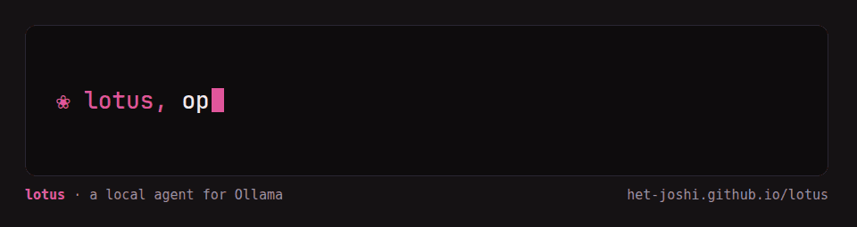

# ❀ lotus

A terminal agent for [Ollama](https://ollama.com) that actually works with small local models.

```
            ,
         .-/ \-.
     .-.( (   ) ).-.
    (   \ \   / /   )
     '-._\_\_/_/_.-'
  ~~~~~~~~~~~~~~~~~~~~~~~~~~
```

Files, shell, web and a real browser, driven by a 4–8B model on your own machine. Pure Python, no dependencies, nothing leaves your laptop.

**Website:** https://het-joshi.github.io/lotus/ · **Docs:** [DOCS.md](DOCS.md)



## Install

```bash
curl -fsSL https://raw.githubusercontent.com/Het-Joshi/lotus/main/install.sh | sh
```

With browser control (adds Playwright and Chromium, about 150 MB):

```bash
curl -fsSL https://raw.githubusercontent.com/Het-Joshi/lotus/main/install.sh | sh -s -- --browser
```

Linux and macOS, no root needed. On Windows, or with pip: `pip install "lotus-agent @ https://github.com/Het-Joshi/lotus/archive/main.tar.gz"`. You also need Ollama and a model: `ollama pull qwen3:4b`.

## Try it

```bash
lotus
```

Then ask for something real:

```text
Open the browser and find the cheapest 1-litre steel water bottle on Amazon, then add it to my cart.
Compare flight prices from Boston to Mumbai for the first week of December and show me a table.
What's eating my disk? Chart the ten biggest folders in my home directory.
Read @server.log and tell me why the API went down at 3am.
Research the three best open-source note-taking apps in parallel and compare them.
Is something running on port 8080? If it's my dev server, stop it.
Over Tor, open the DuckDuckGo onion and find privacy-focused email providers.
Every 30 minutes, check that my .onion site is up and ping me if it isn't.
Is this link safe? bit.ly/free-iphone-claim
Look at @screenshot.png and tell me why the build failed.
/init    (lotus reads this project and writes down how it works in LOTUS.md)
```

It asks before anything with consequences: shell commands, file writes, typing into pages, and buttons like *add to cart*, *buy*, *send* or *delete*. Nothing gets bought unless you approve it.

Or use it in one shot:

```bash
lotus "summarise @notes.md" > summary.md
git diff | lotus "write a commit message"
```

## Things your agent probably can't do

- **Browse the dark web, properly.** `/tor on` sends the browser, search and page reading through Tor, and any `.onion` address switches the browser to Tor by itself. DNS resolves inside Tor, WebRTC can't leak your address, and QUIC is off. This was tested against check.torproject.org, a real WebRTC probe, and DuckDuckGo's onion.
- **Refuse to get phished.** Every page is checked against live malware and phishing lists before it loads. Pages that hide "ignore your instructions" text for AIs are flagged. Passwords and card numbers need your yes even in auto mode, and `.exe`/`.sh`/`.dmg` downloads are refused.
- **Stop thinking in circles.** Small reasoning models love to loop. lotus notices, cuts the loop off, and gets the answer anyway.
- **Run while you sleep.** Recipes are saved prompts. `lotus watch onion-watch --every 30m --notify` checks your hidden services and sends a desktop notification.
- **See.** Drop a screenshot into the prompt and, if your model is text-only, lotus switches to an installed vision model for that message.
- **Draw.** Bar, line and pie charts, sparklines, trees and tables render right in the terminal.
- **Split up work.** Sub-agents take tasks in parallel, each with a fresh context, and hand back only the answer.
- **Live in a pipe or over SSH.** Pipe anything in and get clean markdown out. `/copy` reaches your own clipboard even over SSH.
- **Zero strings attached.** No API keys, no telemetry, no dependencies, no cloud. Your laptop, your model, your data.

## Why it's different

- **Fits small models.** A ~250-token system prompt, tools that load only when needed, and a context window sized to each model, so nothing gets silently cut off.
- **Forgiving tool calls.** Calls a small model writes as plain text, with broken JSON or with the wrong argument names still go through.
- **Stays on task.** Long outputs are paged, stale file reads are retired, the plan stays in view, and old history is compacted into a summary.
- **You're in control.** `Esc` stops it mid-task: the reply, a running command, the browser. Type while it works and your message is queued for next.
- **Remembers per project.** `LOTUS.md` holds instructions and facts for a folder. `.LOTUS_REM.txt` notes where you left off, so the next session picks up from there.
- **Extensible.** MCP servers, Python plugins (a function with a docstring becomes a tool), and recipes that can run on a schedule.

Type `/` inside lotus for every command, and run `lotus doctor` to check your setup. Everything else is in [DOCS.md](DOCS.md).

## License

MIT
